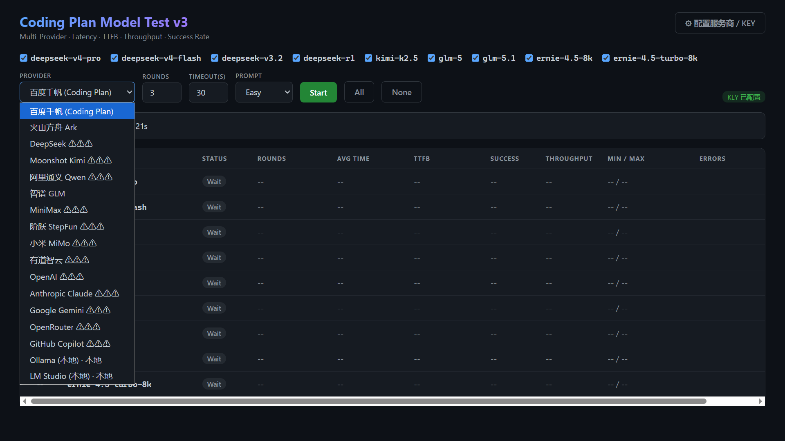
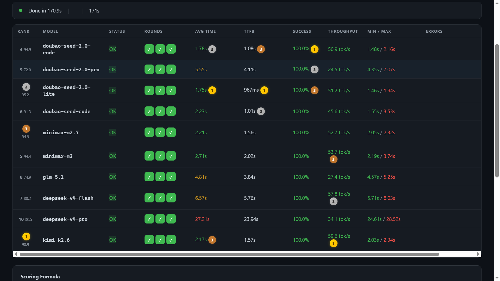
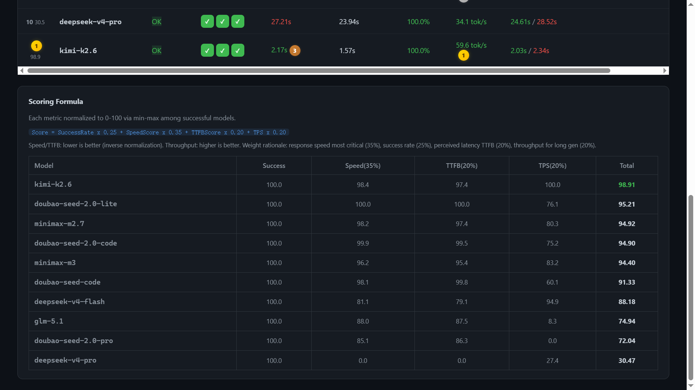
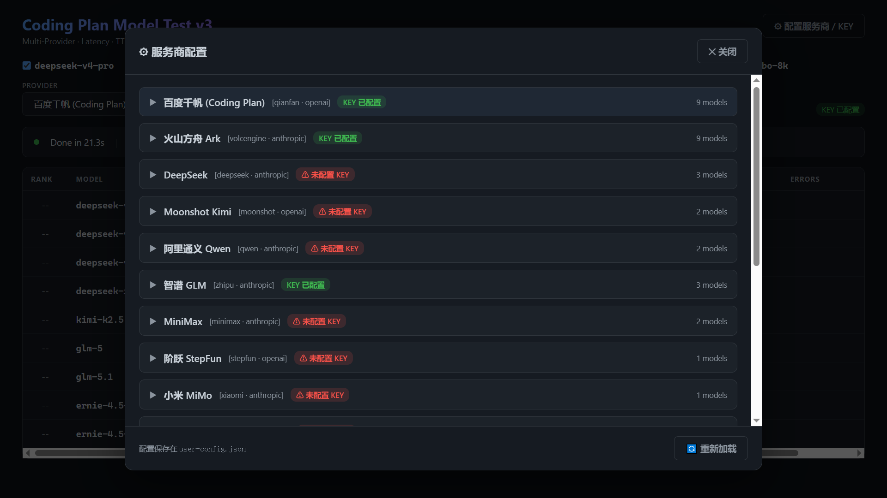
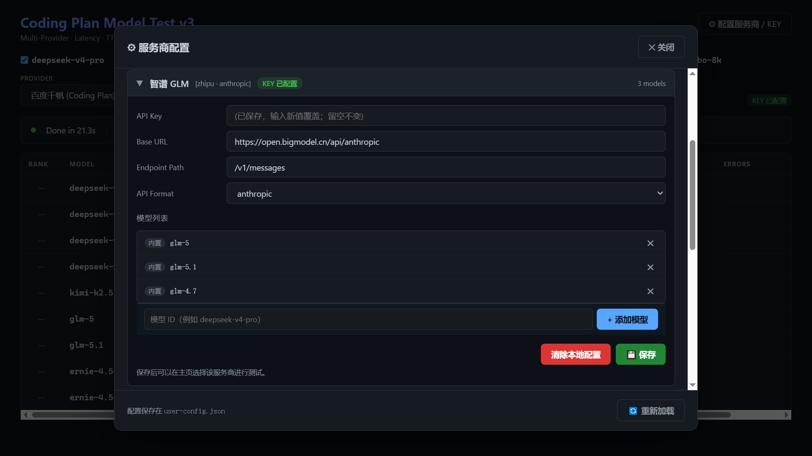

# 🚀 Coding Model Tester

> **多服务商 LLM 编码性能基准测试工具** · 流式测试 · 实时打分 · 内置 19 个主流服务商

[English](./README_EN.md) · 中文

[](https://opensource.org/licenses/MIT)
[](https://nodejs.org)
[]()

---

## ✨ 特性亮点

- 🌐 **19 个内置服务商** — 千帆 / 火山方舟 / 腾讯云 Coding Plan / DeepSeek / 月之暗面 / 通义千问 / 智谱 GLM / MiniMax / OpenAI / Anthropic / Gemini / OpenRouter / GitHub Copilot / Ollama / LM Studio ...
- 🔌 **三种 API 协议** — OpenAI / Anthropic / Gemini，自动适配
- 📊 **完整性能指标** — 总耗时、首字延迟 (TTFB)、吞吐量 (tok/s)、成功率、错误诊断
- 🏆 **智能综合打分** — 成功率(25%) + 速度(35%) + TTFB(20%) + 吞吐(20%)，并排名
- 🎨 **零依赖前端** — 原生 HTML/JS + 现代深色主题，无需构建
- ⚙️ **可视化配置** — 通过 Web UI 填 API Key、改 URL、添加自定义模型
- 🔒 **本地安全** — API Key 仅存本机 `user-config.json`，已加入 `.gitignore`
- 🏠 **支持本地模型** — Ollama、LM Studio 开箱即用

---

## 📸 截图预览

**主面板 · 服务商选择**



**主面板 · 模型测试仪表盘（含排名徽章）**



**主面板 · 综合评分表**



**设置弹窗 · 服务商配置**



**设置弹窗 · KEY 与模型管理**



---

## 🚀 快速开始

### 1. 克隆与安装

```bash
git clone https://github.com/baconag/coding-model-tester.git
cd coding-model-tester
npm install
```

### 2. 启动

```bash
npm start
# 或 Windows 直接双击 start.bat
```

服务监听 [http://localhost:3458](http://localhost:3458)。

### 3. 配置 API Key

打开浏览器 → 点击右上角 **⚙ 配置服务商 / KEY** → 选择服务商 → 填入 Key → **💾 保存**。

配置保存在项目根目录的 `user-config.json`（自动生成，已被 `.gitignore` 排除）。

### 4. 开始测试

主页面下拉选服务商 → 勾选要对比的模型 → **Start**。

---

## 📋 内置服务商一览

| 服务商 | 协议 | 默认 URL | 备注 |
|--------|------|---------|------|
| 百度千帆 (Coding Plan) | openai | `qianfan.baidubce.com/v2/coding` | 百度独享编程套餐 |
| 火山方舟 Ark (Coding Plan) | anthropic | `ark.cn-beijing.volces.com/api/coding` | 字节跳动豆包编码套餐 |
| DeepSeek | anthropic | `api.deepseek.com/anthropic` | |
| Moonshot Kimi | openai | `api.moonshot.cn/v1` | |
| 阿里通义 Qwen | anthropic | `dashscope.aliyuncs.com/apps/anthropic` | |
| 智谱 GLM | anthropic | `open.bigmodel.cn/api/anthropic` | |
| MiniMax | anthropic | `api.minimaxi.com/anthropic` | |
| 腾讯云 Coding Plan (OpenAI) | openai | `api.lkeap.cloud.tencent.com/coding/v3` | TokenHub 编码套餐，聚合 GLM/Kimi/MiniMax/HY |
| 腾讯云 Coding Plan (Anthropic) | anthropic | `api.lkeap.cloud.tencent.com/coding/anthropic` | 同上，不同協议 |
| 阶跃 StepFun | openai | `api.stepfun.com/v1` | |
| 小米 MiMo | anthropic | `api.xiaomimimo.com/anthropic` | |
| 有道智云 | openai | `openapi.youdao.com/llmgateway/api/v1` | |
| OpenAI | openai | `api.openai.com/v1` | |
| Anthropic | anthropic | `api.anthropic.com` | |
| Google Gemini | gemini | `generativelanguage.googleapis.com/v1beta` | |
| OpenRouter | openai | `openrouter.ai/api/v1` | 聚合多家 |
| GitHub Copilot | openai | `api.individual.githubcopilot.com` | |
| Ollama | openai | `localhost:11434/v1` | 本地，无需 Key |
| LM Studio | openai | `localhost:1234/v1` | 本地，无需 Key |

> 想加更多？编辑 [providers-default.json](./providers-default.json) 即可，无需改代码。

---

## 🎯 测试场景

内置 3 套 Prompt：

| 难度 | 任务 |
|------|------|
| **Easy** | 实现快速排序 |
| **Medium** | 实现 O(1) LRU 缓存 |
| **Hard** | 用标准库实现支持 GET/POST 的 HTTP Server |

可在 `public/app.js` 顶部 `PROMPTS` 对象自由扩展。

---

## 📊 综合打分公式

```
Score = SuccessRate × 0.25
      + SpeedScore  × 0.35   (基于平均总耗时，min-max 归一化)
      + TTFBScore   × 0.20   (基于首字延迟，越低越好)
      + TPSScore    × 0.20   (基于吞吐 tok/s，越高越好)
```

前三名会在表格中显示 🥇🥈🥉 徽章。

---

## 🔧 添加新服务商

**方式一：编辑默认配置**（推荐，全员可见）

打开 [providers-default.json](./providers-default.json)，加一段：

```json
"myprovider": {
  "name": "我的服务商",
  "baseUrl": "https://api.example.com/v1",
  "apiFormat": "openai",
  "endpointPath": "/chat/completions",
  "models": [
    { "id": "model-a", "name": "Model A" }
  ]
}
```

**方式二：仅本机自定义**

设置弹窗任一卡片底部输入框 → 输入模型 ID → **+ 添加模型** → 💾 保存。

---

## 🗂️ 项目结构

```
coding-model-tester/
├── server.js                   # Express 后端 + 三协议流式适配
├── providers-default.json      # 默认 provider/URL/模型（可编辑增加）
├── user-config.example.json    # 用户配置模板
├── user-config.json            # 用户本地配置（运行时生成，不入库）
├── public/
│   ├── index.html
│   ├── style.css
│   └── app.js                  # 前端逻辑 + 设置弹窗
├── package.json
├── start.bat                   # Windows 一键启动
├── .gitignore
├── README.md                   # 中文文档（本文）
├── README_EN.md                # English docs
└── LICENSE
```

---

## 🔐 安全说明

- ✅ `user-config.json` 已通过 `.gitignore` 排除，**不会被 git 提交**
- ✅ 后端 `/api/providers` GET 接口**脱敏**，前端列表只能拿到 `hasKey: true/false`
- ✅ 代码中**无任何硬编码 Key**
- ⚠️ `user-config.json` 是**明文存储**，仅限本机使用；勿在公共/共享机器上长期保存
- ⚠️ 该服务**仅监听 localhost**，不要暴露到公网

---

## 🤝 贡献

欢迎 PR！特别欢迎：

- 新增服务商默认配置
- 修复模型 ID / URL 变更
- 优化 UI / 增加图表
- 国际化（i18n）

---

## 📄 License

[MIT](./LICENSE) © 2026 baconag

---

## 🙋 FAQ

**Q: 为什么有的服务商显示"⚠️ 未配置 KEY"？**
A: 内置的只是默认 URL 和模型列表，需要你自己去对应服务商官网申请 Key 后填入。

**Q: 测试结果会保存吗？**
A: 当前版本不保存历史，每次刷新就重置。如需，可自行扩展将 summary 写到本地 JSON。

**Q: 千帆 Coding Plan 是什么？**
A: 百度智能云面向编程场景提供的低延迟独享套餐，与普通对话 API 是不同的 endpoint。

**Q: 能测图片输入吗？**
A: 当前只测文本编码任务。图片场景请另写脚本。

---

如果项目对你有帮助，欢迎点亮 ⭐！
